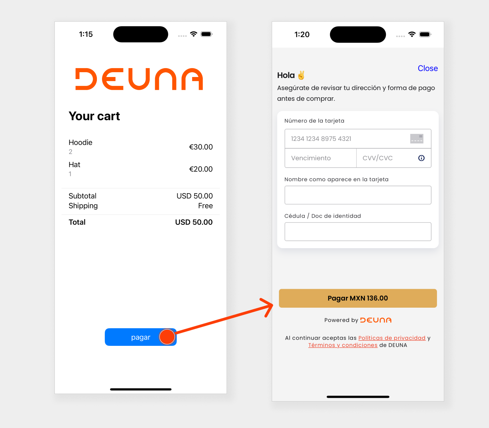

# Basic Integration Example App

Basic Integration is a pre-built UI that shows how to use DEUNAs SDK library to complete a payment

### Features
- Supports all of DEUNAs supported payment methods [Listed here](https://docs.deuna.com/docs)
- Helps you stay PCI compliant

### To run the example app
1. Open `basic-integration.xcodeproj` in Xcode
2. Choose the **Basic Integration Example** target in the top left
3. Configure your credentials in basic-integration/ContentView.swift
4. Choose any simulator and click Run

The example app will show you a button to complete the payment that will open the payment view

ßß